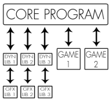

# EPITECH | B-OOP-400 | Arcade


## Description

Arcade is a **gaming platform**: a program that lets the user choose a game to play and keeps a register of player scores.
To be able to deal with the elements of your gaming plate-form at run-time, your graphics libraries and your games
must be implemented as **dynamic libraries**, loaded at run-time.
Each GUI available for the program must be used as a shared library that will be loaded and used dynamically by the main program.

It is **STRICTLY FORBIDDEN** to refer to a graphics library explicitly in your main program.

Only your dynamic libraries can do so.
This also applies to your games.

## Prerequisites

- CMake
- C++20
- SDL2
- NCURSES
- SFML

## Usage

### Build

```bash
$> mkdir ./build && cd ./build/
$> cmake .. -G "Unix Makefiles" -DCMAKE_BUILD_TYPE=Release
[...]
$> cmake --build .
[...]
$> cd ..
```

### Launch arcade

```bash
$> ./arcade [graphical_library.so]
[...]
```

### Key bindings

|  Actions   |  ncurses  |   sfml    |   sdl2    |
|:----------:|:---------:|:---------:|:---------:|
|  Move up   | `Z` / `↑` | `Z` / `↑` | `Z` / `↑` |
| Move down  | `S` / `↓` | `S` / `↓` | `S` / `↓` |
| Move left  | `Q` / `←` | `Q` / `←` | `Q` / `←` |
| Move right | `D` / `→` | `D` / `→` | `D` / `→` |
|    Quit    |    `Q`    | `ESCAPE`  | `ESCAPE`  |

## Architecture

<p align="center">
    
</p>

```
    arcade
    │
    │─ .github/workflows/       workflows
    │
    │─ Core/                    Core program source code
    │
    │─ Games/                   Games libraries source code
    │
    │─ Graphics/                Graphicals libraries source code
    │
    └─ lib/                     Libraries binaries
```

## Commit Norms

| Commit Type | Description                                                                                                               |
|:------------|:--------------------------------------------------------------------------------------------------------------------------|
| build       | Changes that affect the build system or external dependencies (npm, make, etc.)                                           |
| ci          | Changes related to integration files and scripts or configuration (Travis, Ansible, BrowserStack, etc.)                   |
| feat        | Addition of a new feature                                                                                                 |
| fix         | Bug fix                                                                                                                   |
| perf        | Performance improvements                                                                                                  |
| refactor    | Modification that neither adds a new feature nor improves performance                                                     |
| style       | Change that does not affect functionality or semantics (indentation, formatting, adding space, renaming a variable, etc.) |
| docs        | Writing or updating documentation                                                                                         |
| test        | Addition or modification of tests                                                                                         |

## Contributors
- [Elliot Masina](https://github.com/bobis33)
- [Jules Sourbets](https://github.com/wwLeji)
